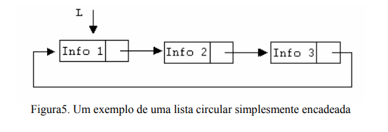

# listas circulares simplesmente encadeadas

Na lista circular é como se ligasse o final da lista com o início. Sendo assim é importante definir para onde o ponteiro da lista está apontando para saber onde inserir e/ou remover os elementos. A figura abaixo demonstra uma lista circular simplesmente encadeada:

algoritmos em pseudocódigo:
## Exibição dos nós em uma lista circular;
1. Iniciar a partir do primeiro nó
   se lista for vazia:
      retornar lista vazia
2. imprimir ponteiroAuxiliar.valor
3. ponteiroAuxiliar = ponteiroAuxiliar.prox
4. Repetir até retornar ao primeiro nó
   enquanto ponteiroAuxiliar não for igual ao primeiro nó

## Inserção de um nó no início da lista:
No novo_item criamos um nó que aponta para o primeiro_item da lista.
O ultimo_item da lista passa a apontar para o novo_item e dessa forma a conexão com o primeiro_item é perdida.

1. Criar o nó;
2. Percorrer a lista e parar no ultimo elemento com o ponteiro auxiliar apontando para o primeiro
3. fazer o nó para o ultimo elemento paontar para o novo elemento

## Exclusão do primeiro nó da lista;.

1. Verificar se a lista está vazia
   se lista for vazia:
      retornar lista vazia
2. Guardar referência para o primeiro nó
   noRemovido = lista
3. lista = lista.prox
4. LiberarMemoria(noRemovido)
      retornar lista
