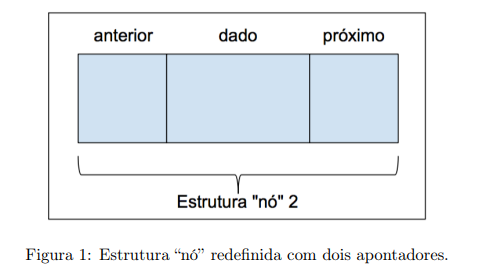
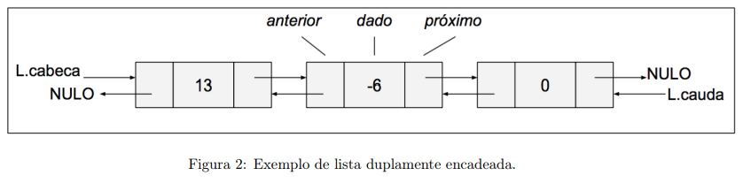

# Lista Duplamente escadeada com os nós ordenados
A lista duplamente encadeada é formada por nós similares ao da lista encadeada simples, porém com um
atributo adicional: um apontador para o nó anterior. Dessa forma, é possível percorrer esse tipo de lista em
ambas as direções. A figura a seguirdefine a estrutura de nó:

Se o apontador "anterior" de um dado nó tem valor NULO, então este é um nó cabeça. Se o apontador "proximo" de um dado nó tem o valor NULO, este é o nó calda (que contêm o ultimo elemento). Se o nó cabeça da lista é NULO, a lista está VAZIA. A figura a seguir ilustra uma lista duplamente encadeada, que faz o uso da nova estrutura de nó.

## Exibição dos nós em uma lista duplamente encadeadas;
1. ESTRUTURA noh *aux= L->cabeca;
2. ENQUANTO aux != NULO FAÇA
3.      IMPRIME aux->dado;
4.      aux = aux->proximo;

## Busca de um nó;
• BUSCAR(L, valor)
1. ESTRUTURA noh *aux = L->cabeca;
2. ENQUANTO aux != NULO E aux->dado < valor FAÇA
3.     aux = aux->proximo;
4. SE aux != NULO E aux->dado == valor ENTAO
5.     RETORNA aux; // Nó encontrado
6. SENAO
7.     RETORNA NULO; // Nó não encontrado

## Inserção de um nó;
1. x->proximo = L->cabeca;
2. SE L->cabeca != NULO ENTAO
3.      L->cabeca->anterior = x;
4. L->cabeca = x;
5. x->anterior = NULO;

## Remoção de um nó;
1. SE x->anterior != NULO ENTAO
2.      x->anterior->proximo = x->proximo;
3. SENAO L->cabeca = x->proximo;
4. SE x->proximo != NULO ENTAO
5.      x->proximo->anterior = x->anterior;
